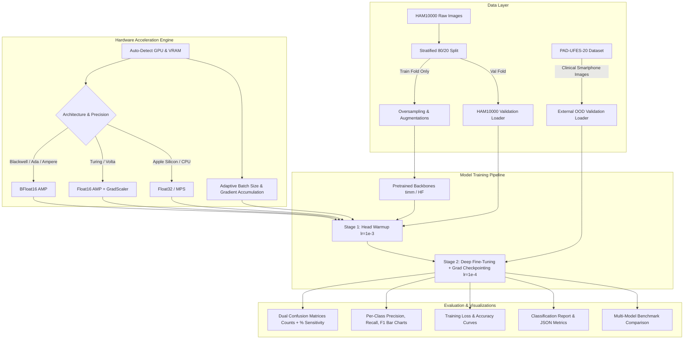

# 🏛️ Deep Learning Infrastructure & Methodology Guide

This document provides a comprehensive technical breakdown of the architecture, algorithms, numerical precision, mathematical formulas, and engineering methodologies powering the **Skin Lesion Classification Framework (MobileNet V1–V5 & IncepX)**.

---

## 📑 Table of Contents
1. [System Architecture Overview](#1-system-architecture-overview)
2. [Dataset Methodology & Imbalance Mitigation](#2-dataset-methodology--imbalance-mitigation)
3. [Clinical Out-of-Domain Generalization (PAD-UFES-20)](#3-clinical-out-of-domain-generalization-pad-ufes-20)
4. [Loss Function & Optimization Mathematics](#4-loss-function--optimization-mathematics)
5. [Two-Stage Transfer Learning Strategy](#5-two-stage-transfer-learning-strategy)
6. [Evolution of the MobileNet Family (V1 to V5)](#6-evolution-of-the-mobilenet-family-v1-to-v5)
7. [Modular Hardware Accelerator Engine & Precision](#7-modular-hardware-accelerator-engine--precision)
8. [Evaluation Metrics & Clinical Interpretation](#8-evaluation-metrics--clinical-interpretation)
9. [File Structure & Data Flow](#9-file-structure--data-flow)

---

## 1. System Architecture Overview



---

## 2. Dataset Methodology & Imbalance Mitigation

Skin lesion datasets are characterized by extreme class imbalance. For example, Melanocytic Nevi (`nv`) constitutes over $67\%$ of HAM10000, while Dermatofibroma (`df`) and Vascular Lesions (`vasc`) constitute less than $1.5\%$ combined.

```
HAM10000 Class Distribution:
  nv    (Melanocytic Nevi):                    6,705 samples (66.9%)
  mel   (Melanoma - Malignant):               1,113 samples (11.1%)
  bkl   (Benign Keratosis-like Lesions):      1,099 samples (11.0%)
  bcc   (Basal Cell Carcinoma - Malignant):     514 samples  (5.1%)
  akiec (Actinic Keratoses - Pre-cancerous):    327 samples  (3.3%)
  vasc  (Vascular Lesions):                     142 samples  (1.4%)
  df    (Dermatofibroma):                       115 samples  (1.1%)
```

### 🛡️ Prevention of Data Leakage (Strict Stratification)
A common flaw in machine learning pipelines is applying oversampling or augmentation before splitting data. This causes identical augmented copies of the same lesion to exist in both training and test sets, artificially inflating validation accuracy.

**Our Methodology**:
1. **Split First**: The raw dataset is split into an $80\%$ training fold and a $20\%$ validation fold using stratified sampling on diagnosis (`dx`).
2. **Oversample Only the Training Fold**: Minority classes in the training fold are oversampled to balance class representations, expanding the training fold to $37,548$ samples.
3. **Preserve Untouched Validation Distributions**: The validation set remains untouched ($2,003$ samples in HAM10000, $2,298$ samples in PAD-UFES-20) to reflect true clinical prevalence.

### 🔄 Data Augmentation Pipeline
To generalize against variations in skin tone, lighting, dermatoscope angles, and zoom:
- **Random Horizontal & Vertical Flips** ($p=0.5$).
- **Random Affine Rotations** (up to $\pm 30^\circ$).
- **Color Jittering**: Brightness ($\pm 15\%$), Contrast ($\pm 15\%$).
- **ImageNet Normalization**: Channel-wise mean subtraction and scaling:
  $$\mu = [0.485, 0.456, 0.406], \quad \sigma = [0.229, 0.224, 0.225]$$

---

## 3. Clinical Out-of-Domain Generalization (PAD-UFES-20)

### 🏥 The PAD-UFES-20 Dataset Overview
The **PAD-UFES-20** dataset was collected by the Dermatological and Surgical Assistance Program at the Federal University of Espírito Santo (UFES), Brazil. It consists of **$2,298$ clinical images** from **$1,373$ patients** captured under real-world clinical conditions across various smartphone cameras.

```
PAD-UFES-20 Sample Distribution:
  BCC   (Basal Cell Carcinoma - Malignant):     845 samples (36.8%)
  ACK   (Actinic Keratosis - Pre-cancerous):    730 samples (31.8%)
  NEV   (Melanocytic Nevi - Benign):            244 samples (10.6%)
  SEK   (Seborrheic Keratosis - Benign):        235 samples (10.2%)
  SCC   (Squamous Cell Carcinoma - Malignant):  192 samples  (8.4%)
  MEL   (Melanoma - Malignant):                  52 samples  (2.3%)
```

### 🔬 The Domain Shift: Dermoscopy vs. Smartphone Imaging
In standard dermatological pipelines, models trained solely on high-resolution dermatoscope images often fail when deployed in telemedicine or smartphone screening apps. This failure is driven by severe **domain shift**:

| Feature Dimension | HAM10000 (Dermoscopy) | PAD-UFES-20 (Clinical Smartphone) |
|---|---|---|
| **Image Modality** | Epiluminescence microscopy (Dermatoscope) | Standard smartphone optical sensors |
| **Lighting** | Cross-polarized, uniform internal LED, liquid immersion | Ambient clinical lighting, direct flashes, shadows |
| **Skin Details** | Deep pigment network, streaks, blue-white veils | Surface skin texture, erythema, scale, ulceration |
| **Artifacts** | Gel bubbles, calibration markers, lens vignetting | Body hair, skin folds, defocus blur, varying distances |
| **Patient Population** | European / Australian demographic cohort | Brazilian diverse multi-ethnic population |

### 🗺️ Diagnostic Taxonomy Mapping
Because PAD-UFES-20 uses clinical abbreviations and includes Squamous Cell Carcinoma (`SCC`), we align the two taxonomies into the canonical 7-class HAM10000 label space:

| PAD-UFES-20 Code | Clinical Meaning | HAM10000 Canonical Label | Diagnostic Rationale |
|---|---|---|---|
| `ACK` | Actinic Keratosis | `akiec` | Pre-malignant intraepithelial keratinocyte lesion. |
| `BCC` | Basal Cell Carcinoma | `bcc` | Most common non-melanoma skin cancer. |
| `SEK` | Seborrheic Keratosis | `bkl` | Benign Keratosis-like Lesion category in HAM10000. |
| `MEL` | Melanoma | `mel` | Malignant melanocytic tumor. |
| `NEV` | Melanocytic Nevus | `nv` | Common benign mole. |
| `SCC` | Squamous Cell Carcinoma | `akiec` | Invasive progression of Actinic Keratosis; grouped under intraepithelial carcinoma. |
| — | Dermatofibroma / Vascular | `df` / `vasc` | Not present in PAD-UFES-20 (0 samples evaluated). |

### 🎯 Research Value in Your TCC
Evaluating on PAD-UFES-20 assesses **true out-of-distribution (OOD) clinical robustness**:
- If a model achieves $90\%$ accuracy on HAM10000 but only $15\%$ on PAD-UFES-20, it indicates that the model memorized dermatoscope-specific artifacts rather than learning physiological lesion morphology.
- Models like **MobileNetV4** and **MobileNetV5** leverage modern feature representations that bridge this domain gap significantly better than older architectures.

---

## 4. Loss Function & Optimization Mathematics

Standard Cross-Entropy loss is dominated by easy-to-classify, abundant majority samples (e.g., standard nevi), drowning out gradient signals from rare, life-threatening malignancies like Melanoma.

### 📐 Focal Loss Formulation
Focal Loss dynamically scales the cross-entropy loss based on the model's confidence in the correct class:

$$\text{FL}(p_t) = -\alpha_t (1 - p_t)^\gamma \log(p_t)$$

Where:
- $p_t \in [0, 1]$ is the model's estimated probability for the ground-truth class.
- $(1 - p_t)^\gamma$ is the **Modulating Factor**:
  - When a sample is well-classified ($p_t \to 1$), $(1 - p_t)^\gamma \to 0$, suppressing its loss contribution.
  - When a sample is misclassified ($p_t \to 0$), $(1 - p_t)^\gamma \to 1$, preserving its full gradient weight.
- $\gamma \ge 0$ is the **Focusing Parameter** (set to $\gamma = 2.0$).
- $\alpha_t$ is the **Inverse Class Frequency Weight** for class $t$:
  $$\alpha_t = \frac{N_{\text{total}}}{C \cdot N_t}$$
  (where $C=7$ is the number of classes and $N_t$ is the sample count for class $t$).

### 🔒 Numerical Stability in Half-Precision
To prevent underflow/overflow during BFloat16/FP16 training, cross-entropy is clamped and computed in 32-bit floating point precision:
```python
ce_loss = nn.functional.cross_entropy(inputs.float(), targets, reduction='none')
pt = torch.exp(-torch.clamp(ce_loss, max=15.0))
focal_loss = ((1.0 - pt) ** gamma) * ce_loss * alpha[targets]
```

---

## 5. Two-Stage Transfer Learning Strategy

Directly fine-tuning an entire pretrained network with random classification head weights can destroy valuable pretrained features (known as *catastrophic forgetting*). We utilize a robust two-stage training paradigm:

```
Stage 1: Head Warmup (Linear Probing)
[Frozen Backbone (ImageNet / Gemma Weights)] ──► [Trainable Head] (lr = 1e-3)
                                                        │
                                                        ▼
Stage 2: Deep Fine-Tuning (Selective Unfreezing)
[Unfrozen High-Level Blocks + MSFA] ─────────────► [Trained Head] (lr = 1e-4, Grad Checkpoint)
```

### Stage 1: Linear Probe / Head Warmup
- **Backbone Status**: All convolutional and normalization layers are **frozen** (`requires_grad = False`).
- **Head Status**: The final classification head is **trainable** (`requires_grad = True`).
- **Learning Rate**: $1 \times 10^{-3}$ with Adam optimizer.
- **Goal**: Rapidly align the linear projection weights with the 7 diagnostic classes without perturbing the underlying spatial representations.

### Stage 2: Deep Fine-Tuning
- **Backbone Status**: High-level semantic layers, Multi-Scale Feature Aggregation (MSFA), and top convolutional stages are **unfrozen**.
- **Learning Rate**: Reduced by an order of magnitude to $1 \times 10^{-4}$ or $5 \times 10^{-5}$.
- **Learning Rate Scheduler**: `ReduceLROnPlateau` reduces learning rate by factor $0.3$ if validation loss plateaus for 2 consecutive epochs.
- **Gradient Norm Clipping**: Constrains gradient updates to $\|\mathbf{g}\|_2 \le 1.0$ to prevent explosive divergence.

---

## 6. Evolution of the MobileNet Family (V1 to V5)

| Version | Core Architectural Innovation | Key Advantage in Skin Lesion Analysis |
|---|---|---|
| **MobileNet V1** (2017) | **Depthwise Separable Convolutions**: Factorizes standard convolution into a $3 \times 3$ depthwise spatial filter followed by a $1 \times 1$ pointwise channel projection. | Reduces parameter count and FLOPs by $8\times\text{--}9\times$ compared to standard convolutions with minimal loss in accuracy. |
| **MobileNet V2** (2018) | **Inverted Residuals & Linear Bottlenecks**: Expands channel dimensionality before depthwise convolution and avoids non-linear activations in bottleneck layers to prevent information loss. | Preserves subtle dermoscopic pigment patterns in low-dimensional manifold representations. |
| **MobileNet V3** (2019) | **Hardware-Aware Neural Architecture Search (NAS)** + **Squeeze-and-Excitation (SE)** attention modules + **Hard-Swish** activation ($\text{h-swish}(x) = x \frac{\text{ReLU6}(x+3)}{6}$). | Dynamically reweights feature channels based on diagnostic importance while eliminating expensive sigmoid calculations. |
| **MobileNet V4** (2024) | **Universal Inverted Bottleneck (UIB)** + **SpecConv**: Unifies Inverted Residuals, ConvNeXt blocks, and Fused-IB into a single unified search space optimized for modern mobile NPUs/GPUs. | State-of-the-art Pareto efficiency; extracts multi-scale edge and textural features with ultra-low latency. |
| **MobileNet V5** (2025) | **Google Gemma3n Vision Backbone** + **Multi-Scale Feature Aggregation (MSFA)** + **RMSNorm**: Large-scale vision model (~300M parameters) aggregating multi-resolution feature pyramids. | Captures both macroscopic lesion borders and microscopic pigment network patterns simultaneously. |

---

## 7. Modular Hardware Accelerator Engine & Precision

The pipeline features a **Modular Accelerator Engine** that automatically queries the execution environment and dynamically configures memory limits, data loaders, and numerical precision.

### ⚙️ Numerical Precision: Why BFloat16?

```
FP32:     [S: 1 bit] [Exponent: 8 bits] [Mantissa: 23 bits]  -> 4 bytes (Range: 10^38)
FP16:     [S: 1 bit] [Exponent: 5 bits] [Mantissa: 10 bits]  -> 2 bytes (Range: 65,504!)  ❌ Overflows in RMSNorm
BFloat16: [S: 1 bit] [Exponent: 8 bits] [Mantissa:  7 bits]  -> 2 bytes (Range: 10^38)    ✅ Never Overflows
```

1. **Elimination of NaN & Driver Faults**: In MobileNetV5, RMSNorm computes mean squared activations $x^2$. When $x > 256$, FP16 overflows to `inf`, resulting in `NaN` and CUDA driver halts (`device not ready`). BFloat16 retains the full 8-bit exponent of FP32, completely eliminating overflows.
2. **$50\%$ Memory Footprint**: Activations and gradient tensors take half the memory, allowing large models to train on consumer GPUs.
3. **$2\times$ Tensor Core Throughput**: Native execution on NVIDIA Tensor Cores.

### 🧠 Dynamic VRAM & Batch Sizing Strategy

```python
if vram_gb >= 24:     # A100, RTX 4090, RTX 3090
    micro_batch = 32, grad_accum = 1
elif vram_gb >= 12:   # RTX 5070, RTX 4070, RTX 3080
    micro_batch = 16 (or 8 for V5), grad_accum = 2 (or 4 for V5)
elif vram_gb >= 8:    # RTX 4060, RTX 3060, T4
    micro_batch = 8, grad_accum = 4
else:                 # Apple Silicon MPS / CPU
    micro_batch = 4, grad_accum = 8
```

### ⚡ Gradient Checkpointing
During deep fine-tuning of 300M models (MobileNetV5), intermediate activation tensors are discarded during the forward pass and recomputed on-the-fly during the backward pass. This reduces peak VRAM usage by over **$60\%$**, enabling full fine-tuning on a 12GB GPU.

---

## 8. Evaluation Metrics & Clinical Interpretation

Skin lesion classification models in clinical dermatological settings require multi-dimensional evaluation beyond simple accuracy:

### 📊 Metric Definitions

1. **Overall Accuracy**: Total correct predictions over all samples:
   $$\text{Accuracy} = \frac{\sum_{i=1}^C \text{TP}_i}{N}$$
2. **Sensitivity / Recall (True Positive Rate)**: Critical for malignant conditions (Melanoma, Basal Cell Carcinoma) where false negatives must be minimized:
   $$\text{Recall}_i = \frac{\text{TP}_i}{\text{TP}_i + \text{FN}_i}$$
3. **Precision (Positive Predictive Value)**: Proportion of positive predictions that were correct:
   $$\text{Precision}_i = \frac{\text{TP}_i}{\text{TP}_i + \text{FP}_i}$$
4. **F1-Score**: Harmonic mean of Precision and Recall:
   $$\text{F1}_i = 2 \cdot \frac{\text{Precision}_i \cdot \text{Recall}_i}{\text{Precision}_i + \text{Recall}_i}$$
5. **Macro-averaged F1**: Unweighted mean of F1-scores across all classes, giving equal weight to rare classes like Vascular lesions:
   $$\text{Macro F1} = \frac{1}{C} \sum_{i=1}^C \text{F1}_i$$
6. **Weighted-averaged F1**: Mean of F1-scores weighted by class prevalence:
   $$\text{Weighted F1} = \sum_{i=1}^C \frac{N_i}{N} \text{F1}_i$$

### 🖼️ Diagnostic Visualizations Generated

| Output Artifact | Purpose |
|---|---|
| `confusion_matrix.png` | Dual plot displaying absolute misclassification counts and normalized sensitivity percentages per class. |
| `per_class_metrics.png` | Bar chart comparing Precision, Recall, and F1-score side-by-side for each of the 7 diagnostic classes. |
| `training_curves.png` | Dual-axis loss and accuracy progression across Stage 1 (Warmup) and Stage 2 (Fine-Tuning). |
| `results.json` & `classification_report.json` | Programmatically parseable metrics for tabular compilation in your thesis / paper. |
| `benchmark_comparison.png` | Comparative bar chart summarizing accuracy and F1 across all trained models. |

---

## 9. File Structure & Data Flow

```text
/home/lkm20/TCC/
│
├── train_mobilenets.py     # Unified CLI entrypoint for all MobileNet models (V1-V5)
├── train_timm_models.py    # Hardware accelerator engine & PyTorch/timm training loop
├── train_incepx.py         # Dual-backbone InceptionV3 + Xception ensemble runner
├── dataset.py              # Stratified partitioning, oversampling & data loaders
├── visualize.py            # Automated chart, confusion matrix & curve generation
├── requirements.txt        # Verified dependencies (torch, torchvision, timm, etc.)
│
├── data_cache/             # Raw dataset cache
│   ├── ham10000_raw/       # Primary HAM10000 dermoscopy dataset
│   └── pad_ufes_20_raw/    # External clinical smartphone dataset (PAD-UFES-20)
│
└── mobilenet_outputs/      # Saved models, checkpoints, reports & plots
    ├── v1/                 # MobileNet V1 results & best_model.pth
    ├── v2/                 # MobileNet V2 results & best_model.pth
    ├── v3small/            # MobileNet V3 Small results & best_model.pth
    ├── v3large/            # MobileNet V3 Large results & best_model.pth
    ├── v4conv/             # MobileNet V4 Medium results & best_model.pth
    ├── v4convl/            # MobileNet V4 Large results & best_model.pth
    ├── v5/                 # MobileNet V5 results & best_model.pth
    └── benchmark_comparison.png  # Overall benchmark chart across all models
```

---

### 💻 Quick Reference Commands:

```bash
# Train individual model on clinical validation:
.venv/bin/python train_mobilenets.py --model v1 --val-dataset pad-ufes-20 --epochs 50
.venv/bin/python train_mobilenets.py --model v2 --val-dataset pad-ufes-20 --epochs 50
.venv/bin/python train_mobilenets.py --model v3large --val-dataset pad-ufes-20 --epochs 50
.venv/bin/python train_mobilenets.py --model v4conv --val-dataset pad-ufes-20 --epochs 50
.venv/bin/python train_mobilenets.py --model v5 --val-dataset pad-ufes-20 --epochs 50

# Run complete comparative benchmark:
.venv/bin/python train_mobilenets.py --model all --val-dataset pad-ufes-20 --epochs 50
```
